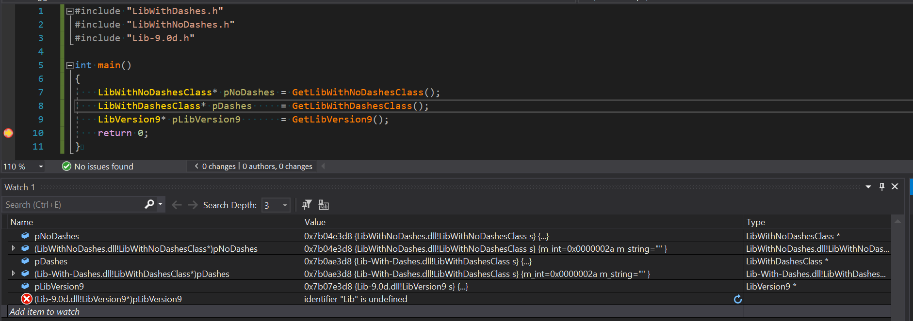

# Debugger Invalid Reference

This is a simple project that will reproduce an issue in Visual Studio 2019 Debugger (native) where we are unable to get the reference of an internal class to a DLL when some pattern of the DLL exist. I though at first that the issue was with dashes in the name of the DLL but so far I was able to reproduce the issue if there is a dash followed by a number.

This project shows one example where the debugger fails to reference a class name with the following dll name *Lib-9.0d*.

This issue was reported to Microsoft at the following link:
<https://developercommunity.visualstudio.com/t/referring-to-a-type-from-another-module-dll-in-the/1485643>

# Instruction

- Open *DebuggerInvalidReference.sln* with Visual Studio 2019
- Compile with configuration Debug (x64)
- Put a break point at the last statement of the main function in *DebuggerInvalidReference\main.cpp*
- Run the application *DebuggerInvalidReference* with the debugger attached.

In the watch window, put the following statement:
- (Lib-9.0d.dll!LibVersion9*)pLibVersion9
